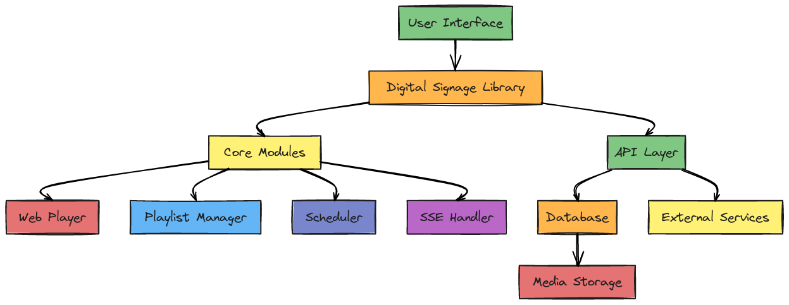

# Digital Signage NPM Package

## Overview

The Digital Signage NPM package is designed to help developers create and manage content for digital signage displays. This package allows for easy scheduling, content management, and display control, ideal for retail, corporate offices, educational institutions, and public information systems.



## Getting Started

Follow these steps to get started with the Digital Signage NPM package:

### 1. Installation

To get started, you first need to install the package via npm. Run the following command in your project directory:

```bash
npm install digital-signage-package
